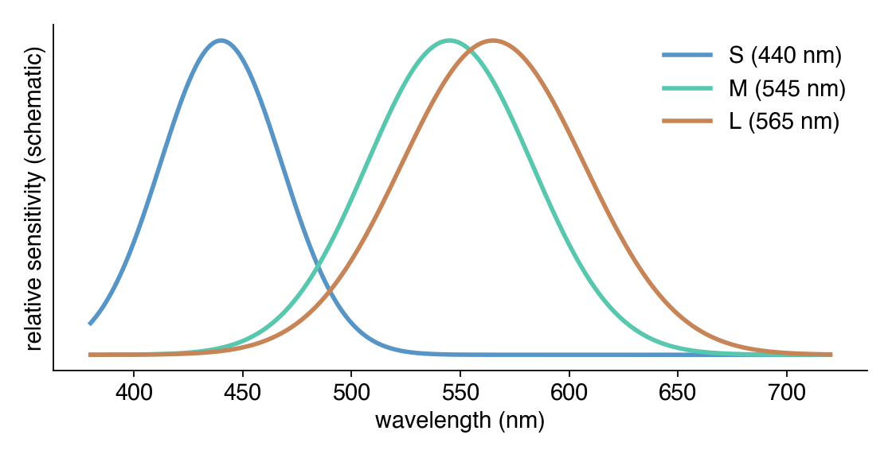
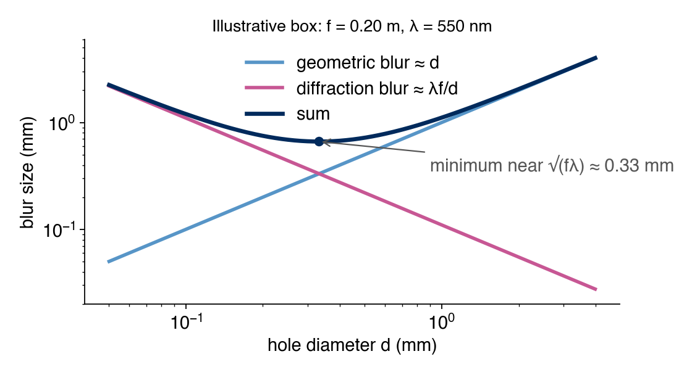
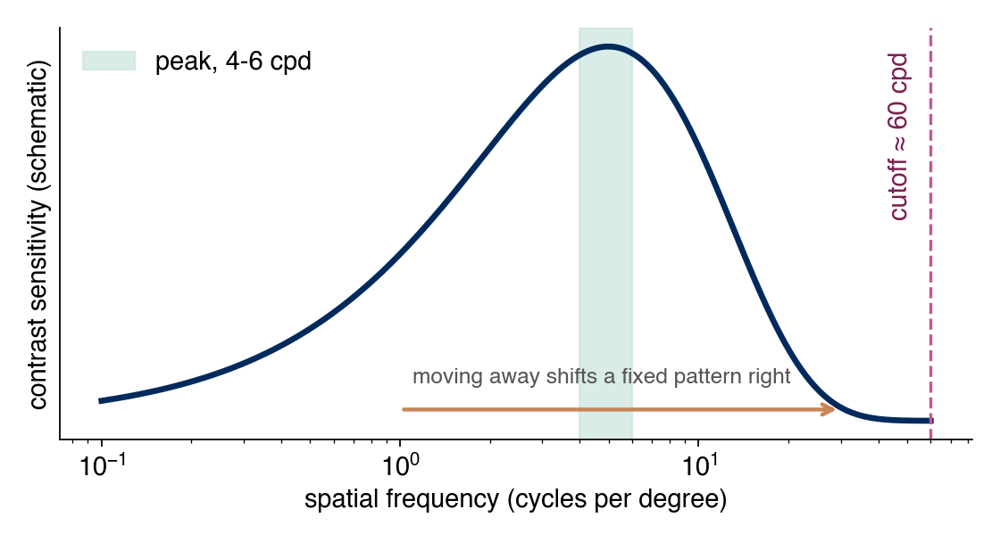
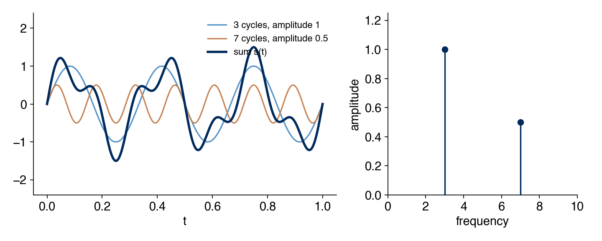
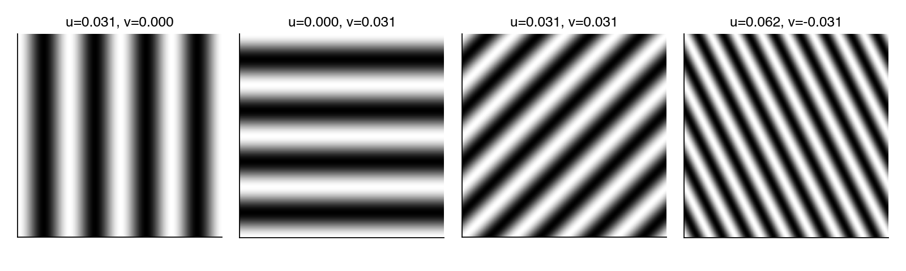

```{=html}
<style>#title-block-header { display: none; }</style>
<div class="lecture-header">
  <h1>Week 1: The Human Visual System, Pinhole Cameras, and Hybrid Images</h1>
</div>
```

**Overview.** Week 1's lecture is about the human visual system: the eye as an optical and sensing instrument, and the perceptual facts (visual acuity, contrast sensitivity, the Fourier view of images) that computational imaging designs around. Homework 1 asks us to build a physical pinhole camera and write code that merges two photographs into a *hybrid image*, whose apparent content changes with viewing distance.

This chapter has two sections. **Section 1, Lecture Content**, follows the lecture's order and is written for a reader who has met none of the vocabulary. Subsections tagged *Background* are not from the lecture: they are inserted just before the point where the lecture (or the homework) starts using a term without explaining it. Those cover angles and repeating patterns (§1.2), the pinhole camera and its two kinds of blur (§1.7, §1.8), the unit "cycles per pixel" (§1.16), and the sampling limit (§1.18). **Section 2, Homework Explanation**, stays close to the homework brief, the problem-session slides, and the completed starter code, and points back to Section 1 for every concept.

## Section 1: Lecture Content {#sec-lecture}

*This section is the Week 1 lecture (D. Lindell, CSC2529), on the human visual system, together with the Oliva/Torralba/Schyns (2006) hybrid-images paper the lecture cites. Subsections marked Background are the notes' own additions and say so at their top.*

### 1.1 Why start a computational imaging course with the human eye? {#sec-why-eye}

Computational imaging designs a whole pipeline: optics, then sensing, then computation, with the goal of producing an image or a piece of information that a human or a downstream algorithm ultimately consumes. Before designing the optics, sensor, or algorithm, it helps to have a model of what the image is really for: human vision.

::: {.definition-block}
**Definition.** **Computational imaging** is optics, sensing, and computation, co-designed together, rather than a fixed lens and a passive sensor with image processing added afterward. A [coded aperture](https://en.wikipedia.org/wiki/Coded_aperture) (a specially shaped lens opening) paired with a matching deconvolution algorithm, designed as one system, is the lecture's example.
:::

The eye is also a physical instrument built from optics (cornea, lens) and sensing (retina). That makes it the fastest way to build intuition for both halves of the design at once.

### 1.2 Units for angles and repeating patterns {#sec-units}

*Background, not from the lecture. The lecture quotes angles in arcminutes and image detail in cycles per degree without defining either. Everything in this chapter uses the vocabulary below.*

Two questions come up in almost every section that follows. How large does something *look* to an eye? And how fine is a pattern of stripes? The first needs a unit for angle. The second needs the idea of a cycle.

#### Degrees, arcminutes, arcseconds

::: {.definition-block}
**Definition.** A **degree** ($1°$) is $1/360$ of a full turn. Smaller angles use two finer units: an **arcminute** ($1'$) is $1/60$ of a degree, and an **[arcsecond](https://en.wikipedia.org/wiki/Minute_and_second_of_arc)** ($1''$) is $1/60$ of an arcminute.
:::

$$1° = 60' = 3600''.$$

Each step is a factor of 60, the same as hours, minutes, and seconds of time. An angle by itself says nothing about size in metres. Its physical size depends on how far away we are, which the next subsection makes precise.

#### Visual angle

::: {.definition-block}
**Definition.** The **visual angle** of an object is the angle between the two straight lines from the eye to the object's two edges. It measures how much of the field of view the object covers.
:::

```{=html}
<svg viewBox="0 0 640 260" xmlns="http://www.w3.org/2000/svg" style="width:100%;max-width:640px;height:auto;font-family:Helvetica,'Helvetica Neue',Arial,sans-serif;">
  <text x="20" y="30" font-size="24" font-weight="700" fill="#205279">Same object, two distances</text>
  <circle cx="50" cy="150" r="12" fill="#C6DEF1" stroke="#5795C7" stroke-width="2"/>
  <text x="34" y="190" font-size="16" fill="#205279">eye</text>

  <line x1="62" y1="150" x2="250" y2="105" stroke="#5795C7" stroke-width="2"/>
  <line x1="62" y1="150" x2="250" y2="195" stroke="#5795C7" stroke-width="2"/>
  <line x1="250" y1="105" x2="250" y2="195" stroke="#8457C7" stroke-width="5"/>
  <text x="258" y="155" font-size="16" fill="#442079">size s</text>

  <line x1="62" y1="150" x2="520" y2="115" stroke="#C7A857" stroke-width="2" stroke-dasharray="5 4"/>
  <line x1="62" y1="150" x2="520" y2="185" stroke="#C7A857" stroke-width="2" stroke-dasharray="5 4"/>
  <line x1="520" y1="105" x2="520" y2="195" stroke="#8457C7" stroke-width="5"/>
  <text x="528" y="155" font-size="16" fill="#442079">size s</text>

  <text x="110" y="222" font-size="16" fill="#205279">near: large angle</text>
  <text x="330" y="245" font-size="16" fill="#796020">far: small angle</text>
  <line x1="62" y1="238" x2="250" y2="238" stroke="#555" stroke-width="1"/>
  <text x="120" y="256" font-size="14" fill="#555">distance d</text>
</svg>
```

*The same object (size $s$) placed near and far. The dashed lines to the far copy enclose a smaller angle.*

Two objects of the same physical size can have very different visual angles, and two objects of different size can have the same one. That is why the lecture states acuity (§1.11) and screen sharpness (§1.12) in angles rather than in centimetres.

For an object of size $s$ at distance $d$, straight ahead, the right-triangle geometry gives the visual angle $\alpha$ from

$$\tan\!\left(\frac{\alpha}{2}\right) = \frac{s/2}{d} \quad\Longleftrightarrow\quad s = 2d\tan\!\left(\frac{\alpha}{2}\right).$$

The second form is the one the lecture uses (§1.12): given an angle and a distance, it returns a physical size. For small angles, size is nearly proportional to distance: an object twice as far away must be twice as large to cover the same angle.

The table gives the physical size that some visual angles cover at a distance of 1 m, computed from the second form of the equation.

| Visual angle | Size at 1 m |
|---|---|
| $1°$ | about $17.5$ mm |
| $1'$ | about $0.29$ mm |
| $1''$ | about $0.005$ mm ($4.8$ µm) |

#### Cycles and spatial frequency

Later sections talk about stripes and detail, so we need a number for "how fine." Start with a **grating**: a pattern of alternating light and dark stripes, like a barcode.

::: {.definition-block}
**Definition.** One **cycle** of a repeating pattern is one full repeat: a light stripe followed by a dark stripe, back to the start of the next light stripe. Its length along the image is the **period**. The **spatial frequency** is the number of cycles per unit length, the reciprocal of the period:

$$\text{spatial frequency} = \frac{1}{\text{period}}.$$
:::

```{=html}
<svg viewBox="0 0 640 210" xmlns="http://www.w3.org/2000/svg" style="width:100%;max-width:640px;height:auto;font-family:Helvetica,'Helvetica Neue',Arial,sans-serif;">
  <text x="20" y="30" font-size="24" font-weight="700" fill="#205279">One cycle of a grating</text>
  <rect x="40" y="55" width="60" height="60" fill="#f4f4f4" stroke="#888"/>
  <rect x="100" y="55" width="60" height="60" fill="#333" stroke="#888"/>
  <rect x="160" y="55" width="60" height="60" fill="#f4f4f4" stroke="#888"/>
  <rect x="220" y="55" width="60" height="60" fill="#333" stroke="#888"/>
  <rect x="280" y="55" width="60" height="60" fill="#f4f4f4" stroke="#888"/>
  <rect x="340" y="55" width="60" height="60" fill="#333" stroke="#888"/>
  <line x1="40" y1="135" x2="160" y2="135" stroke="#C75794" stroke-width="3"/>
  <line x1="40" y1="128" x2="40" y2="142" stroke="#C75794" stroke-width="3"/>
  <line x1="160" y1="128" x2="160" y2="142" stroke="#C75794" stroke-width="3"/>
  <text x="50" y="165" font-size="16" fill="#792051">period = 1 cycle</text>
  <text x="420" y="90" font-size="16" fill="#555">3 cycles fit in</text>
  <text x="420" y="112" font-size="16" fill="#555">this 360-unit strip,</text>
  <text x="420" y="134" font-size="16" fill="#555">so frequency = 3 / 360</text>
  <text x="420" y="156" font-size="16" fill="#555">cycles per unit</text>
</svg>
```

*A grating with a period of 120 units: three cycles across 360 units. Fine, tightly packed stripes have a high spatial frequency; wide stripes have a low one.*

The unit of length is our choice, and the choice matters. Later we will count cycles per pixel (§1.16), per inch, and per degree of visual angle (§1.15). The same pattern gets a different number in each unit, and the word "frequency" also names two unrelated things (colour and flicker rate), which §1.15 separates explicitly.

Symbols used throughout the chapter:

| Symbol | Meaning | Unit |
|---|---|---|
| $\alpha$ | visual angle | degrees or arcminutes |
| $d$ | viewing distance (§1.2, §1.12), or pinhole diameter (§1.8) | length |
| $s$, $p$ | object size; physical size of one pixel | length |
| $f$ | pinhole-to-screen distance | length |
| $\lambda$ | wavelength of light | nanometres |
| $u, v$ | horizontal and vertical image frequency | cycles per pixel |
| $W$ | image width | pixels |

The letter $d$ serves two roles in this chapter (viewing distance, pinhole diameter). We say which one is meant each time it appears.


### 1.3 Anatomy of the eye {#sec-eye-anatomy}

*From the lecture.* The eye works like a camera with a lens at the front and a light-sensitive layer at the back. The figure shows the parts we need, front to back; the table gives each part's job.

```{=html}
<svg viewBox="0 0 640 300" xmlns="http://www.w3.org/2000/svg" style="width:100%;max-width:640px;height:auto;font-family:Helvetica,'Helvetica Neue',Arial,sans-serif;">
  <text x="20" y="30" font-size="24" font-weight="700" fill="#205279">Cross-section of the eye</text>
  <ellipse cx="330" cy="170" rx="170" ry="105" fill="#FAEDCB" stroke="#C7A857" stroke-width="3"/>
  <ellipse cx="205" cy="170" rx="22" ry="58" fill="#C6DEF1" stroke="#5795C7" stroke-width="2"/>
  <path d="M 175 105 Q 150 170 175 235" fill="none" stroke="#5795C7" stroke-width="4"/>
  <line x1="195" y1="100" x2="195" y2="135" stroke="#C75794" stroke-width="6"/>
  <line x1="195" y1="205" x2="195" y2="240" stroke="#C75794" stroke-width="6"/>
  <path d="M 470 105 Q 505 170 470 235" fill="none" stroke="#8457C7" stroke-width="5"/>
  <circle cx="490" cy="170" r="5" fill="#792051"/>
  <line x1="500" y1="200" x2="560" y2="230" stroke="#C78557" stroke-width="8"/>

  <text x="40" y="60" font-size="16" fill="#205279">cornea</text>
  <line x1="90" y1="65" x2="160" y2="115" stroke="#888" stroke-width="1"/>
  <text x="120" y="275" font-size="16" fill="#792051">iris / pupil</text>
  <line x1="185" y1="262" x2="195" y2="240" stroke="#888" stroke-width="1"/>
  <text x="235" y="82" font-size="16" fill="#205279">lens</text>
  <line x1="225" y1="87" x2="210" y2="115" stroke="#888" stroke-width="1"/>
  <text x="330" y="175" font-size="16" fill="#796020">vitreous humour</text>
  <text x="520" y="120" font-size="16" fill="#442079">retina</text>
  <line x1="518" y1="126" x2="490" y2="140" stroke="#888" stroke-width="1"/>
  <text x="520" y="175" font-size="16" fill="#792051">fovea</text>
  <text x="530" y="260" font-size="16" fill="#794520">optic nerve</text>
</svg>
```

*Schematic eye, light entering from the left. Not to scale.*

| Structure | Role |
|---|---|
| **[Cornea](https://en.wikipedia.org/wiki/Cornea)** | The clear, curved front surface. Provides most of the eye's fixed focusing power; it is a strong, non-adjustable lens. |
| **[Aqueous humour](https://en.wikipedia.org/wiki/Aqueous_humour)** | Clear fluid between cornea and lens; maintains eye pressure and shape. |
| **[Iris](https://en.wikipedia.org/wiki/Iris_(anatomy)) / [pupil](https://en.wikipedia.org/wiki/Pupil)** | The iris is the coloured muscle ring; the pupil is the hole at its centre. The iris widens or narrows the pupil to control how much light enters, the eye's **[aperture](https://en.wikipedia.org/wiki/Aperture)**. |
| **[Lens](https://en.wikipedia.org/wiki/Lens_(vertebrate_anatomy))** | A flexible, adjustable lens behind the iris that fine-tunes focus by changing shape (see accommodation, §1.9). |
| **[Ciliary muscle](https://en.wikipedia.org/wiki/Ciliary_muscle) / [zonular fibers](https://en.wikipedia.org/wiki/Zonule_of_Zinn)** | Muscle and fibers attached to the lens that squeeze or relax it to change its focal power. |
| **[Vitreous humour](https://en.wikipedia.org/wiki/Vitreous_body)** | Clear gel filling the main eyeball cavity, behind the lens. |
| **[Retina](https://en.wikipedia.org/wiki/Retina)** | The light-sensitive layer at the back of the eye; the eye's **sensor** (§1.4). |
| **[Choroid](https://en.wikipedia.org/wiki/Choroid)** | A blood-vessel-rich layer behind the retina that supplies oxygen and nutrients and absorbs stray light, the same role the black interior paint plays in a pinhole camera (§1.7): stopping internal reflections from washing out contrast. |
| **[Sclera](https://en.wikipedia.org/wiki/Sclera)** | The white, tough outer shell of the eyeball; structural support, like a camera body. |
| **[Fovea](https://en.wikipedia.org/wiki/Fovea_centralis)** | A small pit in the retina, directly behind the pupil, densely packed with cone photoreceptors; where sharp, colour vision happens (§1.4). |
| **[Optic disc](https://en.wikipedia.org/wiki/Optic_disc)** | Where the optic nerve and retinal blood vessels exit the eye. It has no photoreceptors, which makes it the **[blind spot](https://en.wikipedia.org/wiki/Blind_spot_(vision))**. |
| **[Optic nerve](https://en.wikipedia.org/wiki/Optic_nerve)** | Carries the electrical signal from retina to brain. |

An **[image sensor](https://en.wikipedia.org/wiki/Image_sensor)**, the electronic chip in a digital camera that sits where photographic film used to go, converts incoming light into an electrical signal. The retina does the same job biologically.

::: {.definition-block}
**Definition.** **[Accommodation](https://en.wikipedia.org/wiki/Accommodation_(vertebrate_eye))** is the eye's ability to change focus by physically changing the lens's shape: the ciliary muscle contracts, the lens becomes rounder and more powerful, and near objects come into focus.
:::

An **[emmetropic](https://en.wikipedia.org/wiki/Emmetropia)** eye is a normal-sighted eye (§1.9, refractive errors).

### 1.4 The retina: rods and cones {#sec-retina}

*From the lecture.* The retina is a layered neural circuit, not a passive light-sensitive film. Light passes through the front layers before it reaches the light detectors at the back:

1. [Ganglion cells](https://en.wikipedia.org/wiki/Retinal_ganglion_cell) and [bipolar cells](https://en.wikipedia.org/wiki/Retina_bipolar_cell) (plus horizontal and amacrine cells doing lateral processing) sit in front.
2. The [photoreceptors](https://en.wikipedia.org/wiki/Photoreceptor_cell), rods and cones, sit at the very back, pointed away from the incoming light.
3. The photoreceptor signal then travels forward again through the bipolar and ganglion cells, whose axons bundle into the optic nerve.

There are two types of photoreceptor:

| | Rods | Cones |
|---|---|---|
| Count | ~120 million | ~6 million |
| Sensitivity | Very high; used in low-light and night vision | Lower; need brighter light |
| Colour | Colourblind, one type only | Three types (colour vision, §1.5) |
| Location | Spread across the retina's periphery | Densely packed in the fovea (centre) |
| Acuity | Low spatial resolution | High spatial resolution |

Sharp, colourful vision exists only in the small central fovea. We constantly move our eyes ("saccades") to sample different parts of a scene with it, so we do not perceive the world at uniform high resolution the way a camera sensor captures a frame. This non-uniform, foveated sampling recurs later in the course, in light-field and foveated displays and in compressive or adaptive sensing.

::: {.callout-note}
**A measured number.** Roorda and Williams (1999, *Nature*) imaged the living human cone mosaic in the fovea and found individual [cones](https://en.wikipedia.org/wiki/Cone_cell) spaced about 0.5 arcminutes of visual angle apart (an arcminute is 1/60 of a degree; see §1.2).

This is consistent with two later numbers. By the sampling logic in §1.18, a ~0.5 arcminute sampling pitch predicts a resolution limit around 1 arcminute, matching §1.11's 20/20 figure, and a spatial-frequency cutoff around 60 cycles per degree, matching §1.15's contrast-sensitivity cutoff.
:::

### 1.5 Colour perception {#sec-color}

*From the lecture.* [Visible light](https://en.wikipedia.org/wiki/Visible_spectrum) is a narrow band, roughly 400-700 nanometers, of the full [electromagnetic spectrum](https://en.wikipedia.org/wiki/Electromagnetic_spectrum), between ultraviolet and infrared. Its **wavelength** $\lambda$ (the length of one wave, in nanometers) is what we perceive as colour.

Colour vision comes from three types of cones, each with a different, overlapping sensitivity curve over wavelength:

| Cone | Peak | Looks |
|---|---|---|
| **S** (short) | ~440 nm | bluish |
| **M** (medium) | ~545 nm | greenish |
| **L** (long) | ~565 nm | yellowish-red |

{fig-alt="Three overlapping bell-shaped curves peaking near 440, 545 and 565 nanometres."}

*Schematic S, M, and L cone sensitivity over wavelength. The peak positions are the lecture's; the curve widths are illustrative.*

The M and L curves overlap heavily, which is why "green" and "red" cone signals are strongly correlated. Colour is represented as a three-number ([tristimulus](https://en.wikipedia.org/wiki/CIE_1931_color_space#CIE_XYZ_color_space)) space rather than by measuring wavelength directly because there are exactly three cone classes: the eye does not measure wavelength, it measures three overlapping weighted sums of the incoming spectrum.

::: {.definition-block}
**Definition.** **[Metamerism](https://en.wikipedia.org/wiki/Metamerism_(color))** is the phenomenon where two physically different light spectra produce the same three cone responses and so look identical. It is the reason RGB displays and cameras work at all: they only need to match the eye's three cone responses, not reproduce the true physical spectrum.
:::

### 1.6 Eye versus camera {#sec-eye-vs-camera}

*From the lecture.* The lecture draws a direct structural analogy.

| Eye | Camera |
|---|---|
| Cornea and lens | Lens |
| Iris and pupil | Aperture |
| Retina | Image sensor |
| Fovea (non-uniform density, denser at centre) | Uniform pixel grid |
| Three cone types, irregularly interleaved | Bayer colour filter array (regular RGGB mosaic) |

#### How a camera gets colour

A digital camera sensor is colourblind on its own: an individual light-sensing pixel measures brightness only, with no way to tell what wavelength it absorbed. To get colour, manufacturers place a **[Bayer colour filter array](https://en.wikipedia.org/wiki/Bayer_filter)** directly on the sensor: a physical grid of tiny red, green, and blue filters, one filter per pixel.

```{=html}
<svg viewBox="0 0 640 230" xmlns="http://www.w3.org/2000/svg" style="width:100%;max-width:640px;height:auto;font-family:Helvetica,'Helvetica Neue',Arial,sans-serif;">
  <text x="20" y="30" font-size="24" font-weight="700" fill="#205279">The Bayer RGGB tile</text>
  <rect x="40" y="60" width="60" height="60" fill="#F7D9C4" stroke="#C78557" stroke-width="2"/>
  <text x="62" y="97" font-size="20" fill="#794520">R</text>
  <rect x="100" y="60" width="60" height="60" fill="#C9E4DE" stroke="#57C7AE" stroke-width="2"/>
  <text x="122" y="97" font-size="20" fill="#207965">G</text>
  <rect x="40" y="120" width="60" height="60" fill="#C9E4DE" stroke="#57C7AE" stroke-width="2"/>
  <text x="62" y="157" font-size="20" fill="#207965">G</text>
  <rect x="100" y="120" width="60" height="60" fill="#C6DEF1" stroke="#5795C7" stroke-width="2"/>
  <text x="122" y="157" font-size="20" fill="#205279">B</text>
  <text x="40" y="205" font-size="16" fill="#555">one 2x2 tile, repeated over the sensor</text>
  <text x="250" y="90" font-size="16" fill="#555">each pixel records ONE number:</text>
  <text x="250" y="115" font-size="16" fill="#555">the R, G, or B light its filter passed.</text>
  <text x="250" y="150" font-size="16" fill="#555">The other two channels at that pixel</text>
  <text x="250" y="175" font-size="16" fill="#555">are estimated from its neighbours.</text>
</svg>
```

*One RGGB tile. Green appears twice because human vision is most sensitive to green (§1.5).*

Every pixel is single-colour, not multi-colour. A pixel under a green filter measures only the green component of the light hitting that spot, because the filter physically blocked the other wavelengths. What is multi-colour is the grid as a whole, arranged in a repeating $2\times 2$ tile. RGGB describes the mosaic pattern, not any property of a single pixel.

#### Reconstruction

Because each pixel records only one channel, a full-colour photograph is a **reconstruction**. For each pixel, the two channels it did not measure are estimated from neighbouring pixels that measured different colours. This step is called *[demosaicking](https://en.wikipedia.org/wiki/Demosaicing)* (Week 3). Two-thirds of every pixel's RGB value in a final photo is computed, not measured.

Two disanalogies are worth keeping in mind. The retina's cone mosaic is irregular, not a neat repeating grid like the Bayer pattern. And sampling density on the retina is non-uniform (dense at the fovea, sparse at the periphery), unlike a camera sensor's uniform sampling. Both matter again when the course covers demosaicking (Week 3) and non-uniform or adaptive sampling schemes.


### 1.7 The simplest camera: a pinhole {#sec-geo-optics}

*Background, not from the lecture. The lecture is about the eye; Homework 1 asks us to build a camera with no lens. This subsection explains why a hole alone forms an image, and the next explains what limits how sharp that image can be.*

How does a hole with no lens form a recognizable image at all?

::: {.definition-block}
**Definition.** A **pinhole camera** is an imaging device with no lens: a light-tight enclosure with a single small aperture on one side and a light-sensitive surface (film, sensor, or, in the homework's case, a screen photographed by a separate camera) on the opposite side. A darkened room used the same way is a [camera obscura](https://en.wikipedia.org/wiki/Camera_obscura) (Latin for "dark chamber").
:::

Every point on the scene radiates light in many directions at once. Without any barrier, that light lands everywhere on the screen and washes out to a uniform grey. A barrier with a small hole passes only the rays that travel in a straight line from the scene point through the hole. Light from one scene point therefore lands mostly in one place on the screen.

```{=html}
<svg viewBox="0 0 640 260" xmlns="http://www.w3.org/2000/svg" style="width:100%;max-width:640px;height:auto;font-family:Helvetica,'Helvetica Neue',Arial,sans-serif;">
  <line x1="40" y1="60" x2="40" y2="160" stroke="#8457C7" stroke-width="4"/>
  <text x="20" y="50" font-size="16" fill="#442079">scene</text>

  <rect x="220" y="40" width="360" height="160" fill="#FAEDCB" stroke="#C7A857" stroke-width="2"/>
  <text x="240" y="30" font-size="16" fill="#796020">box interior (light-tight)</text>

  <circle cx="220" cy="110" r="4" fill="#205279"/>
  <text x="150" y="105" font-size="16" fill="#205279">pinhole</text>

  <line x1="40" y1="60" x2="220" y2="110" stroke="#5795C7" stroke-width="2"/>
  <line x1="40" y1="60" x2="580" y2="160" stroke="#5795C7" stroke-width="2" stroke-dasharray="4 3"/>
  <line x1="40" y1="160" x2="220" y2="110" stroke="#5795C7" stroke-width="2"/>
  <line x1="40" y1="160" x2="580" y2="60" stroke="#5795C7" stroke-width="2" stroke-dasharray="4 3"/>

  <line x1="580" y1="50" x2="580" y2="170" stroke="#C75794" stroke-width="4"/>
  <text x="440" y="222" font-size="16" fill="#792051">screen (inverted image)</text>

  <line x1="220" y1="235" x2="580" y2="235" stroke="#555" stroke-width="1"/>
  <text x="360" y="255" font-size="16" fill="#555">focal length f</text>
</svg>
```

*Rays from the top of the scene cross at the pinhole and reach the bottom of the screen, and vice versa, so the image is upside down.*

Rays travel in straight lines and the hole acts as a single point, so a ray from the top of the scene passes through the hole and continues downward. That is why the image forms inverted. The problem session shows this with an accidental example: a crack in a Toronto grain silo wall projects the waterfront onto the silo's curved interior.

::: {.definition-block}
**Definition.** In a pinhole camera the **focal length** $f$ is simply the distance from the pinhole to the screen. It is not a lens property, since there is no lens. It sets the image scale.
:::

For a fixed scene, a larger $f$ makes the projected image larger. A screen of fixed width then captures only a narrower slice of the scene, so the **field of view** shrinks. Using the same right-triangle geometry as §1.2, a screen of width $w$ at distance $f$ sees a total angle

$$\theta = 2\arctan\!\left(\frac{w}{2f}\right).$$

The formula is the visual-angle relation of §1.2 turned around: the screen is the "object," the pinhole is the "eye." Task 1 of the homework asks for the field of view of our own box; the number depends on our measurements and is left to the assignment.

### 1.8 Two blurs, one best hole {#sec-diffraction}

*Background, not from the lecture.* If a smaller hole always gave a sharper image, the homework would simply ask for the smallest pinhole we can make. It does not, because two separate blurring effects pull in opposite directions as the hole shrinks.

::: {.definition-block}
**Definition.** **Blur** means a single scene point lands on the screen as a small spot of light instead of a single point. The spot's width is the **blur size**. The image is the sum of these spots over every scene point, so bigger spots mean a softer image with less fine detail.
:::

#### Geometric blur: the hole has a width

A hole of diameter $d$ is not a mathematical point, so it admits a narrow *cone* of rays from each scene point, not one ray. Those rays leave the hole heading in slightly different directions and land at slightly different places.

::: {.definition-block}
**Definition.** **Geometric blur** is the spot on the screen produced by the bundle of rays that a hole of finite width lets through. It follows from straight-line ray geometry alone. No wave behaviour is involved.
:::

```{=html}
<svg viewBox="0 0 640 260" xmlns="http://www.w3.org/2000/svg" style="width:100%;max-width:640px;height:auto;font-family:Helvetica,'Helvetica Neue',Arial,sans-serif;">
  <text x="20" y="30" font-size="24" font-weight="700" fill="#205279">Geometric blur</text>
  <rect x="290" y="60" width="20" height="55" fill="#FAEDCB" stroke="#C7A857" stroke-width="2"/>
  <rect x="290" y="155" width="20" height="55" fill="#FAEDCB" stroke="#C7A857" stroke-width="2"/>
  <line x1="40" y1="118" x2="560" y2="118" stroke="#5795C7" stroke-width="2"/>
  <line x1="40" y1="135" x2="560" y2="135" stroke="#5795C7" stroke-width="2"/>
  <line x1="40" y1="152" x2="560" y2="152" stroke="#5795C7" stroke-width="2"/>
  <line x1="562" y1="55" x2="562" y2="215" stroke="#C75794" stroke-width="3"/>
  <line x1="562" y1="116" x2="562" y2="154" stroke="#792051" stroke-width="9"/>
  <line x1="322" y1="118" x2="322" y2="152" stroke="#555" stroke-width="1"/>
  <text x="330" y="140" font-size="16" fill="#555">d</text>
  <text x="80" y="110" font-size="16" fill="#205279">parallel rays from a distant point</text>
  <text x="420" y="240" font-size="16" fill="#792051">spot on screen, width about d</text>
</svg>
```

*A distant scene point sends nearly parallel rays. They pass through the hole and land as a spot as wide as the hole.*

For a scene point far away compared with the box (the usual case for a landscape photo), the rays reaching the hole are nearly parallel. Parallel rays passing through a hole of width $d$ stay parallel afterwards, so they land as a spot about as wide as the hole:

$$\text{geometric blur} \approx d.$$

A 3 mm hole smears every scene point into a spot of about 3 mm, and a 0.1 mm hole into about 0.1 mm. Geometric blur says one thing: **make the hole smaller and the image gets sharper.**

#### Diffraction blur: waves spread out when squeezed

The geometric picture treats light as straight rays. Light is also a wave, and a wave forced through an opening close to its own wavelength does not continue in a straight line. It fans out on the far side.

::: {.definition-block}
**Definition.** **[Diffraction](https://en.wikipedia.org/wiki/Diffraction)** is the spreading of a wave after it passes through an opening or around an edge. The narrower the opening compared with the wavelength $\lambda$, the wider the spread. **Diffraction blur** is the spot this spreading makes on the screen: even a perfectly narrow beam aimed at the hole lands as a spot with a bright centre and faint rings around it, the **[Airy disk](https://en.wikipedia.org/wiki/Airy_disk)**.
:::

```{=html}
<svg viewBox="0 0 640 260" xmlns="http://www.w3.org/2000/svg" style="width:100%;max-width:640px;height:auto;font-family:Helvetica,'Helvetica Neue',Arial,sans-serif;">
  <text x="20" y="30" font-size="24" font-weight="700" fill="#205279">Diffraction fan-out</text>
  <rect x="60" y="60" width="16" height="50" fill="#FAEDCB" stroke="#C7A857" stroke-width="2"/>
  <rect x="60" y="160" width="16" height="50" fill="#FAEDCB" stroke="#C7A857" stroke-width="2"/>
  <line x1="76" y1="135" x2="290" y2="119" stroke="#57C7AE" stroke-width="2"/>
  <line x1="76" y1="135" x2="290" y2="151" stroke="#57C7AE" stroke-width="2"/>
  <line x1="292" y1="115" x2="292" y2="155" stroke="#207965" stroke-width="7"/>
  <text x="50" y="235" font-size="16" fill="#207965">wide hole: small fan-out</text>

  <rect x="350" y="60" width="16" height="70" fill="#FAEDCB" stroke="#C7A857" stroke-width="2"/>
  <rect x="350" y="140" width="16" height="70" fill="#FAEDCB" stroke="#C7A857" stroke-width="2"/>
  <line x1="366" y1="135" x2="600" y2="75" stroke="#C75794" stroke-width="2"/>
  <line x1="366" y1="135" x2="600" y2="195" stroke="#C75794" stroke-width="2"/>
  <line x1="602" y1="70" x2="602" y2="200" stroke="#792051" stroke-width="7"/>
  <text x="340" y="235" font-size="16" fill="#792051">narrow hole: large fan-out</text>
</svg>
```

*The narrower the opening, the wider the wave spreads by the time it reaches the screen.*

The fan-out angle is roughly $\lambda / d$ (the exact constant, about 1.22 to the first dark ring, depends on how the spot's edge is defined). A beam that fans out by an angle $\theta$ and then travels a distance $f$ widens by about $f\theta$, so

$$\text{diffraction blur} \approx \frac{\lambda f}{d}$$

up to that constant. This is **larger for a smaller hole**, the opposite dependence from geometric blur. It is also larger for a longer box (larger $f$) and for redder light (larger $\lambda$). Diffraction is negligible for a wide hole, where $\lambda / d$ is tiny, and dominant once the hole shrinks toward the wavelength of visible light (roughly 400-700 nanometers, per §1.5).

#### The two together

The pinhole camera's total blur is roughly the sum of the two. The table uses an illustrative box ($f = 0.20$ m, green light $\lambda = 550$ nm), with constants ignored:

| Hole diameter $d$ | Geometric blur $\approx d$ | Diffraction blur $\approx \lambda f / d$ | Total | Which dominates |
|---|---|---|---|---|
| 0.10 mm | 0.10 mm | 1.10 mm | 1.20 mm | Diffraction |
| 0.33 mm | 0.33 mm | 0.33 mm | 0.66 mm | Balanced, smallest total |
| 1.0 mm | 1.0 mm | 0.11 mm | 1.11 mm | Geometry |
| 3.0 mm | 3.0 mm | 0.04 mm | 3.04 mm | Geometry |

{fig-alt="Curves of geometric blur rising, diffraction blur falling, and their sum with a minimum near 0.33 millimetres."}

*Geometric blur (rising line), diffraction blur (falling curve), and their sum for the same illustrative box. The sum is smallest where the two are about equal.*

A tiny hole is sharp in the ray picture and ruined by diffraction. A large hole barely diffracts and is ruined by geometry. The best hole sits between them. Setting the derivative of the sum with respect to $d$ to zero gives $d \propto \sqrt{f\lambda}$, and the balanced row is $\sqrt{(0.20)(550\times 10^{-9})} \approx 0.33$ mm. The leading constant depends on exactly how each blur is measured, so this argument fixes the shape of the formula but not its constant. Petzval's 1857 version gives $d = \sqrt{2f\lambda} \approx 1.41\sqrt{f\lambda}$. The constant of 2 in the formula below is Lord Rayleigh's (1891), reached from wave-optics assumptions:

::: {.boxed-eq}
$$d = 2\sqrt{f\lambda}$$
:::

The optimal diameter grows with the box length $f$ and with the wavelength $\lambda$, since both make diffraction worse and so call for a somewhat larger hole. The problem session states this formula and cites the [pinhole camera](https://en.wikipedia.org/wiki/Pinhole_camera) Wikipedia article without derivation.

::: {.callout-note}
**Worked example.** For the same illustrative box ($f = 0.20$ m, $\lambda = 550$ nm $= 550 \times 10^{-9}$ m; not any particular student's measured box):

$$d = 2\sqrt{(0.20)(550 \times 10^{-9})}$$

$$= 2\sqrt{1.1 \times 10^{-7}} \approx 2 \times 3.3 \times 10^{-4}\ \text{m}$$

$$\approx 6.6 \times 10^{-4}\ \text{m} \approx 0.66\ \text{mm}.$$

Computing the optimal diameter for a specific box's own measured $f$, as Homework 1 Task 1 Question 9 asks, is left to the assignment. So is the qualitative comparison across the three required pinhole sizes in Task 2: which blur we expect to dominate at each size follows from the reasoning above.
:::

### 1.9 Accommodation and refractive errors {#sec-accommodation}

*From the lecture.* Accommodation range, the span of distances the eye can bring into sharp focus, shrinks with age. At roughly 16 years old it spans about 8 cm to infinity. By roughly 50 years old it typically narrows to about 50 cm to infinity, with the near range largely lost. This age-related loss is **[presbyopia](https://en.wikipedia.org/wiki/Presbyopia)**, why people need reading glasses as they age: the lens stiffens and the ciliary muscle can no longer deform it enough for close focus.

**[Refractive errors](https://en.wikipedia.org/wiki/Refractive_error)** are defined by where light rays converge relative to the retina.

| Condition | What happens | Correction |
|---|---|---|
| Emmetropia | Rays focus exactly on the retina | None needed |
| [Myopia](https://en.wikipedia.org/wiki/Myopia) (nearsightedness) | Rays focus in front of the retina (eyeball too long, or cornea too curved) | Concave (diverging) lens |
| [Hyperopia](https://en.wikipedia.org/wiki/Farsightedness) (farsightedness) | Rays focus behind the retina (eyeball too short) | Convex (converging) lens |
| [Astigmatism](https://en.wikipedia.org/wiki/Astigmatism) | Cornea is irregularly curved, so rays never converge to a single point | Cylindrical lens (corrects only the irregular axis) |

This is a concrete instance of a pattern that recurs throughout computational imaging: optics can be broken in a specific, geometrically describable way, and correction is a matter of adding a compensating optical element or a compensating computation.

### 1.10 Field of view {#sec-fov}

*From the lecture.* The [field of view](https://en.wikipedia.org/wiki/Field_of_view) is the total angle of the scene a viewer or camera can take in at once. For humans:

| Region | Approximate angle |
|---|---|
| Horizontal, both eyes together | 190° |
| Binocular overlap (both eyes see it) | 120° |
| Vertical | 135° |
| Horizontal, one eye alone | 160° (about 100° temporal plus 60° nasal) |

The 190° figure is the two-eye total, not a one-eye figure. This bears directly on display design, since a wide-field-of-view VR headset is trying to fill as much of this natural visual field as possible. It also connects to the pinhole box of Homework 1, whose field of view is a function of pinhole-to-screen distance and screen size (§1.7).

### 1.11 Visual acuity {#sec-acuity}

*From the lecture.* Visual angle and the arcminute are defined in §1.2.

**[20/20 vision](https://en.wikipedia.org/wiki/Visual_acuity)**, the reference for "normal" acuity, corresponds to being able to resolve detail at about 1 arcminute of visual angle. The **[Snellen chart](https://en.wikipedia.org/wiki/Snellen_chart)**, the familiar eye-test letter chart, is built around this: each letter's individual strokes are designed to subtend 1 arcminute at the standard test distance when a reader can just barely read that row, with the whole letter subtending 5 arcminutes.

Acuity is fundamentally a statement about the smallest angle the visual system can resolve, not a raw distance or pixel count. This angular framing is what lets us compare a phone screen 30 cm from the face to a movie screen 10 m away on equal footing (§1.12).

### 1.12 Retina displays: a worked example {#sec-retina-display}

*From the lecture.* This is the lecture's worked example of turning acuity (§1.11) into an engineering number. If the eye can just resolve an angle $\alpha$ (about 1 arcminute), and a viewer sits at distance $d$ from a screen, what is the physical size $p$ of the smallest resolvable feature (a pixel)?

Here $d$ is the viewing distance. The right-triangle relation of §1.2 gives the answer directly:

::: {.boxed-eq}
$$p = 2 d \tan\!\left(\frac{\alpha}{2}\right)$$
:::

The resolvable feature subtends $\alpha$ at the eye, so half its width is $d\tan(\alpha/2)$ and the full width is twice that.

**dpi** is the same fact about pixel size, turned upside down. $p$ is a length, how physically big one resolvable pixel is. **[dpi](https://en.wikipedia.org/wiki/Dots_per_inch)** ("dots per inch") is a density, how many of those pixel-widths fit into one inch. Since $p$ is already "inches per pixel," dpi is its reciprocal:

$$\text{dpi} = \frac{1\ \text{inch}}{p}.$$

*dpi* is historically a printing term, since a printer physically deposits ink dots on paper. The more precise screen term is **[ppi](https://en.wikipedia.org/wiki/Pixel_density)**, pixels per inch, but the lecture and this course treat the two as interchangeable, the same way Apple's own marketing did.

::: {.callout-note}
**Worked example (Steve Jobs' "Retina Display" claim).** A tablet viewed at 12 inches, with $\alpha = 1$ arcminute.

Step 1, pixel size:

$$p = 2 \times 12\ \text{in} \times \tan(0.5\ \text{arcmin}) \approx 0.0035\ \text{in}.$$

Step 2, density:

$$\text{dpi} = \frac{1}{0.0035} \approx 286.$$

Apple's marketing claim was 300 dpi, slightly above the computed 286 dpi threshold. The claim is a checkable physical statement, and it holds up with a small safety margin.
:::

The same formula shows that how many pixels the eye can resolve depends entirely on viewing distance. A screen designed to be "retina" at 12 inches would look pixelated at 3 inches and be wastefully over-resolved at 3 meters. This exact idea, the same physical image carrying different perceived detail depending on distance, is the mechanism behind hybrid images (§1.19), and Homework 1 Task 3 asks us to compute it for a printed photo at two viewing distances (§2.4).


### 1.13 Dynamic range {#sec-dynamic-range}

*From the lecture.*

::: {.definition-block}
**Definition.** **[Dynamic range](https://en.wikipedia.org/wiki/Dynamic_range)** is the ratio between the brightest and darkest signal a system can represent, usually expressed in **[f-stops](https://en.wikipedia.org/wiki/F-number)** (each stop is a factor of $2\times$) or orders of magnitude (factors of $10\times$).
:::

The lecture gives three figures:

| System | Dynamic range |
|---|---|
| Human vision, all adaptation states (starlight to sunlight) | about 14 orders of magnitude ($10^{14}\times$) |
| Human vision, instantaneous (no re-adapting of pupil or photoreceptors) | about 5 orders of magnitude |
| Typical digital display (at the time of the cited slide) | about 3 orders of magnitude |

This large gap between what the eye can perceive and what a standard display can reproduce is the motivation for HDR (high dynamic range) imaging and displays (Week 4). One example is "Sunnybrook"-style displays, which add a secondary low-resolution backlight array behind an LCD panel to multiply the achievable contrast ratio.

### 1.14 Contrast {#sec-contrast}

*From the lecture.* Before defining a contrast *sensitivity* function, we need a numeric definition of contrast itself, and there is more than one. Which applies depends on whether we describe a single feature or a repeating pattern.

::: {.definition-block}
**Definition.** **[Weber contrast](https://en.wikipedia.org/wiki/Contrast_(vision)#Weber_contrast)**, for a single small feature on a large uniform background, is

$$C_{\text{Weber}} = \frac{I_{\text{feature}} - I_{\text{background}}}{I_{\text{background}}}.$$
:::

::: {.definition-block}
**Definition.** **[Michelson contrast](https://en.wikipedia.org/wiki/Contrast_(vision)#Michelson_contrast)**, for a periodic pattern such as the gratings of §1.2 where no single "background" exists, is

$$C_{\text{Michelson}} = \frac{I_{\max} - I_{\min}}{I_{\max} + I_{\min}}.$$

It is normalized by the sum of the pattern's brightest and darkest parts. Equivalently, it is half the difference (the pattern's amplitude) divided by the average of $I_{\max}$ and $I_{\min}$.
:::

Here $I$ is brightness. Contrast-sensitivity experiments use grating stimuli, so Michelson contrast is the natural definition there (§1.15).

### 1.15 Cycles per degree and the contrast sensitivity function {#sec-csf-lecture}

*From the lecture, with the unit explained from scratch.* This is the most important technical concept of Week 1 and the direct theoretical basis for Homework 1 Task 3.

#### Three meanings of "frequency"

The word is overloaded. From here through §1.19, "frequency" always means spatial frequency.

| Kind | What oscillates | Typical unit | Where it appears |
|---|---|---|---|
| Light frequency (or wavelength) | the electromagnetic wave | Hz, or wavelength in nm | colour (§1.5) |
| Temporal frequency | a signal over time | Hz | flicker, video frame rate (§1.23) |
| **Spatial frequency** | brightness across space | cycles per unit length | detail, stripes, image content |

A "high-frequency" region of a still photo can be any colour. It has nothing to do with time.

#### Why cycles per degree

A grating printed on paper has a fixed number of cycles per centimetre, a property of the ink that never changes. But the visual system experiences visual angle (§1.2), not centimetres. Visual angle shrinks as we back away and grows as we step closer. So vision science asks a perceptual question: how many light-dark cycles fit into one degree of the visual field, from wherever the viewer stands?

::: {.definition-block}
**Definition.** **Cycles per degree (cpd)** is the number of grating cycles that fit inside one degree of visual angle. It is the spatial frequency measured in the eye's own units.
:::

To get it, first find how long one degree is on the page. At distance $d$, one degree covers $2d\tan(0.5°)$ (§1.2). Then multiply by the grating's cycles per unit length:

$$\text{cpd} = \frac{\text{cycles}}{\text{cm}} \times \frac{\text{cm}}{\text{degree}}$$

$$\frac{\text{cm}}{\text{degree}} = 2d\tan(0.5°)$$

::: {.callout-note}
**Worked example.** A grating whose cycles are 1 cm wide is 1 cycle/cm. One degree covers about $1.75$ cm at $d = 1$ m (from §1.2's table).

| Viewing distance | cm per degree | cpd = $1 \times$ cm per degree |
|---|---|---|
| 0.5 m | about 0.87 | about 0.87 |
| 1 m | about 1.75 | about 1.75 |
| 2 m | about 3.49 | about 3.49 |

The ink on the page never changes. Only how many of its cycles fit inside one degree changes, and that depends entirely on viewing distance. Standing farther away raises cpd.
:::

#### The contrast sensitivity function

::: {.definition-block}
**Definition.** Campbell and Robson (1968) showed subjects sinusoidal gratings at different spatial frequencies and different contrasts (§1.14), and found the minimum contrast at which a subject could just barely detect the stripes. The reciprocal of that minimum detectable contrast is the **[contrast sensitivity](https://en.wikipedia.org/wiki/Contrast_(vision)#Contrast_sensitivity)** at that frequency: low minimum-detectable contrast means high sensitivity. The **contrast sensitivity function (CSF)** plots this sensitivity against spatial frequency in cpd.
:::

{fig-alt="Schematic band-pass curve of contrast sensitivity against cycles per degree, peaking near 5 and falling to zero near 60."}

*Schematic CSF. The peak and cutoff are the lecture's numbers; the curve's exact shape between them is illustrative.*

The CSF is **band-pass**, not low-pass or flat:

- Sensitivity is reduced at very low spatial frequencies (large, slowly varying patterns are genuinely hard to notice).
- Sensitivity peaks around 4-6 cpd.
- Sensitivity falls to zero around ~60 cpd at the high end. This is set by cone packing density: stripes finer than the photoreceptor mosaic can sample cannot be perceived, the same sampling limit as the ~0.5 arcminute cone spacing in §1.4.

Because cpd depends on viewing distance, the same physical pattern sits at a different point on this curve as we move. Moving closer lowers its cpd, potentially toward the 4-6 cpd peak (more visible). Moving farther raises its cpd, potentially past ~60 cpd (less visible, eventually invisible).

::: {.callout-note}
**A photo with fine detail.** Hairline brushstrokes have a fixed physical size but not a fixed cpd.

- *Far away:* the strokes subtend a tiny visual angle, so many cram into one degree, pushing their cpd past the ~60 cpd cutoff. They become invisible.
- *Up close:* the same strokes subtend a larger visual angle, so fewer fit into one degree, dropping their cpd into the visible range.

A single physical image can therefore contain content visible only up close (high spatial frequency) stacked with content that stays visible from far away (low spatial frequency). That is how a hybrid image works (§1.19).
:::

### 1.16 Cycles per pixel {#sec-cycles-per-pixel}

*Background, not from the lecture. Homework 1 states its filter cutoff in cycles per pixel, so we build the unit up slowly.*

The last section measured frequency against the viewer's field of view. A digital image has a third natural ruler: its own pixels.

::: {.definition-block}
**Definition.** **Cycles per pixel** (also called **image frequency**) is the number of full brightness cycles per pixel of width along the image. It is the reciprocal of the period measured in pixels:

$$\text{frequency (cycles/pixel)} = \frac{1}{\text{period (pixels/cycle)}}.$$

It is a property of the pixel array alone. It does not depend on how large the image is printed or how far away it is viewed.
:::

Two copies of the same image file, one on a phone and one on a cinema screen, have identical image frequency, because that number never leaves the file's own pixel-index coordinate system.

```{=html}
<svg viewBox="0 0 930 210" xmlns="http://www.w3.org/2000/svg" style="width:100%;max-width:930px;height:auto;font-family:Helvetica,'Helvetica Neue',Arial,sans-serif;">
  <text x="20" y="30" font-size="24" font-weight="700" fill="#205279">Period in pixels and cycles per pixel</text>
  <rect x="60" y="55" width="30" height="30" fill="#f4f4f4" stroke="#888"/>
  <rect x="90" y="55" width="30" height="30" fill="#f4f4f4" stroke="#888"/>
  <rect x="120" y="55" width="30" height="30" fill="#f4f4f4" stroke="#888"/>
  <rect x="150" y="55" width="30" height="30" fill="#f4f4f4" stroke="#888"/>
  <rect x="180" y="55" width="30" height="30" fill="#333" stroke="#888"/>
  <rect x="210" y="55" width="30" height="30" fill="#333" stroke="#888"/>
  <rect x="240" y="55" width="30" height="30" fill="#333" stroke="#888"/>
  <rect x="270" y="55" width="30" height="30" fill="#333" stroke="#888"/>
  <rect x="300" y="55" width="30" height="30" fill="#f4f4f4" stroke="#888"/>
  <rect x="330" y="55" width="30" height="30" fill="#f4f4f4" stroke="#888"/>
  <rect x="360" y="55" width="30" height="30" fill="#f4f4f4" stroke="#888"/>
  <rect x="390" y="55" width="30" height="30" fill="#f4f4f4" stroke="#888"/>
  <rect x="420" y="55" width="30" height="30" fill="#333" stroke="#888"/>
  <rect x="450" y="55" width="30" height="30" fill="#333" stroke="#888"/>
  <rect x="480" y="55" width="30" height="30" fill="#333" stroke="#888"/>
  <rect x="510" y="55" width="30" height="30" fill="#333" stroke="#888"/>
  <text x="555" y="76" font-size="16" fill="#205279">period 8: 1/8 = 0.125 cycles/pixel</text>
  <rect x="60" y="100" width="30" height="30" fill="#f4f4f4" stroke="#888"/>
  <rect x="90" y="100" width="30" height="30" fill="#f4f4f4" stroke="#888"/>
  <rect x="120" y="100" width="30" height="30" fill="#333" stroke="#888"/>
  <rect x="150" y="100" width="30" height="30" fill="#333" stroke="#888"/>
  <rect x="180" y="100" width="30" height="30" fill="#f4f4f4" stroke="#888"/>
  <rect x="210" y="100" width="30" height="30" fill="#f4f4f4" stroke="#888"/>
  <rect x="240" y="100" width="30" height="30" fill="#333" stroke="#888"/>
  <rect x="270" y="100" width="30" height="30" fill="#333" stroke="#888"/>
  <rect x="300" y="100" width="30" height="30" fill="#f4f4f4" stroke="#888"/>
  <rect x="330" y="100" width="30" height="30" fill="#f4f4f4" stroke="#888"/>
  <rect x="360" y="100" width="30" height="30" fill="#333" stroke="#888"/>
  <rect x="390" y="100" width="30" height="30" fill="#333" stroke="#888"/>
  <rect x="420" y="100" width="30" height="30" fill="#f4f4f4" stroke="#888"/>
  <rect x="450" y="100" width="30" height="30" fill="#f4f4f4" stroke="#888"/>
  <rect x="480" y="100" width="30" height="30" fill="#333" stroke="#888"/>
  <rect x="510" y="100" width="30" height="30" fill="#333" stroke="#888"/>
  <text x="555" y="121" font-size="16" fill="#205279">period 4: 1/4 = 0.25 cycles/pixel</text>
  <rect x="60" y="145" width="30" height="30" fill="#f4f4f4" stroke="#888"/>
  <rect x="90" y="145" width="30" height="30" fill="#333" stroke="#888"/>
  <rect x="120" y="145" width="30" height="30" fill="#f4f4f4" stroke="#888"/>
  <rect x="150" y="145" width="30" height="30" fill="#333" stroke="#888"/>
  <rect x="180" y="145" width="30" height="30" fill="#f4f4f4" stroke="#888"/>
  <rect x="210" y="145" width="30" height="30" fill="#333" stroke="#888"/>
  <rect x="240" y="145" width="30" height="30" fill="#f4f4f4" stroke="#888"/>
  <rect x="270" y="145" width="30" height="30" fill="#333" stroke="#888"/>
  <rect x="300" y="145" width="30" height="30" fill="#f4f4f4" stroke="#888"/>
  <rect x="330" y="145" width="30" height="30" fill="#333" stroke="#888"/>
  <rect x="360" y="145" width="30" height="30" fill="#f4f4f4" stroke="#888"/>
  <rect x="390" y="145" width="30" height="30" fill="#333" stroke="#888"/>
  <rect x="420" y="145" width="30" height="30" fill="#f4f4f4" stroke="#888"/>
  <rect x="450" y="145" width="30" height="30" fill="#333" stroke="#888"/>
  <rect x="480" y="145" width="30" height="30" fill="#f4f4f4" stroke="#888"/>
  <rect x="510" y="145" width="30" height="30" fill="#333" stroke="#888"/>
  <text x="555" y="166" font-size="16" fill="#205279">period 2: 1/2 = 0.5 cycles/pixel</text>
  <text x="60" y="200" font-size="16" fill="#555">Each square is one pixel. Period 2 is the fastest pattern the grid can hold.</text>
</svg>
```

*Each row is one row of pixels, bright and dark. The shorter the period, the higher the frequency.*

The frequency is below 1 for almost everything, because a cycle needs at least two pixels to exist. A frequency of 0.25 cycles/pixel is just another way of saying "one cycle every 4 pixels." The fastest pattern a pixel grid can hold flips every single pixel: a period of 2 pixels, or 0.5 cycles/pixel. A period of 1 pixel would mean no visible change at all. This 0.5 ceiling is the Nyquist frequency of §1.18.

#### Cycles per pixel versus cycles per image

The function `fft2` (§1.17) reports frequency as a count of cycles across the *whole* image. The two differ by the image width $W$ in pixels:

$$\text{cycles/pixel} = \frac{\text{cycles/image}}{W}, \qquad \text{cycles/image} = \text{cycles/pixel} \times W.$$

A pattern with 8 cycles across a 256-pixel-wide image has a period of 32 pixels and a frequency of $8/256 = 0.03125$ cycles/pixel. The same 8 cycles across a 1024-pixel-wide image give $8/1024 \approx 0.0078$ cycles/pixel, a coarser pattern in pixel terms.

#### From the file to the viewer

Three rulers measure the same pattern, and each conversion needs exactly one extra fact.

```{=html}
<svg viewBox="0 0 700 230" xmlns="http://www.w3.org/2000/svg" style="width:100%;max-width:700px;height:auto;font-family:Helvetica,'Helvetica Neue',Arial,sans-serif;">
  <text x="20" y="30" font-size="24" font-weight="700" fill="#205279">Three rulers for one pattern</text>
  <rect x="20" y="60" width="180" height="70" fill="#C6DEF1" stroke="#5795C7" stroke-width="2"/>
  <text x="34" y="90" font-size="16" fill="#205279">cycles per pixel</text>
  <text x="34" y="112" font-size="14" fill="#205279">fixed by the file</text>
  <rect x="260" y="60" width="180" height="70" fill="#FAEDCB" stroke="#C7A857" stroke-width="2"/>
  <text x="274" y="90" font-size="16" fill="#796020">cycles per inch</text>
  <text x="274" y="112" font-size="14" fill="#796020">fixed once printed</text>
  <rect x="500" y="60" width="180" height="70" fill="#F7D9C4" stroke="#C78557" stroke-width="2"/>
  <text x="514" y="90" font-size="16" fill="#794520">cycles per degree</text>
  <text x="514" y="112" font-size="14" fill="#794520">depends on the viewer</text>
  <path d="M 200 95 L 258 95" stroke="#555" stroke-width="2" marker-end="url(#arrow2)"/>
  <path d="M 440 95 L 498 95" stroke="#555" stroke-width="2" marker-end="url(#arrow2)"/>
  <text x="204" y="160" font-size="16" fill="#555">x dpi</text>
  <text x="404" y="160" font-size="16" fill="#555">x inches per degree</text>
  <text x="204" y="185" font-size="14" fill="#555">(pixels/inch)</text>
  <text x="404" y="185" font-size="14" fill="#555">(from distance)</text>
  <defs>
    <marker id="arrow2" markerWidth="8" markerHeight="8" refX="6" refY="4" orient="auto">
      <path d="M0,0 L8,4 L0,8 z" fill="#555"/>
    </marker>
  </defs>
</svg>
```

*The file's number is multiplied by the print density (dpi, §1.12), then by how much of the print one degree covers.*

The chain in symbols, with the unit cancellation shown:

$$\frac{\text{cycles}}{\text{inch}} = \frac{\text{cycles}}{\text{pixel}} \times \frac{\text{pixels}}{\text{inch}}$$

$$\frac{\text{cycles}}{\text{degree}} = \frac{\text{cycles}}{\text{inch}} \times \frac{\text{inches}}{\text{degree}}$$

The two steps combine into a single ratio. The number of pixels that fit into one degree is **pixels per degree**, and

$$\frac{\text{cycles}}{\text{pixel}} = \frac{\text{cycles}/\text{degree}}{\text{pixels}/\text{degree}}.$$

The "per degree" cancels. If we know how fine a pattern the eye handles best (cycles per degree) and how many pixels the viewer's degree is spread over, dividing gives how fine that pattern must be in the pixel grid.

::: {.callout-note}
**Worked example A (file to viewer; made-up numbers, not the homework's).** A digital image has a fine texture with a period of 6 pixels, printed at 150 dpi and viewed from 1 m.

Step 1, image frequency (a fact about the file):

$$\frac{1}{6} \approx 0.167\ \text{cycles/pixel}.$$

Step 2, print frequency:

$$0.167 \times 150 = 25\ \text{cycles/inch}.$$

Step 3, pixel size and pixels per degree. One pixel is $25.4/150 \approx 0.169$ mm, and one degree at 1 m covers about $17.45$ mm:

$$\text{pixels/degree} = \frac{17.45}{0.169} \approx 103.$$

Step 4, cycles per degree:

$$0.167 \times 103 \approx 17\ \text{cpd}.$$

Moving the viewer changes step 4 only. The image frequency and the print frequency stay fixed.
:::

::: {.callout-note}
**Worked example B (viewer to file; made-up numbers).** We want a pattern that appears at 12 cycles/degree, and the viewing setup puts 30 pixels into each degree.

$$\frac{12\ \text{cycles/degree}}{30\ \text{pixels/degree}} = 0.4\ \text{cycles/pixel}.$$

That is a period of $1/0.4 = 2.5$ pixels, close to the fastest pattern the grid can hold. Now walk the viewer back until 60 pixels fit in each degree. The file has not changed, so the pattern is still 0.4 cycles/pixel, but its frequency for the viewer is $0.4 \times 60 = 24$ cycles/degree, twice as fine.
:::

Cycles per pixel is fixed by the file, cycles per degree changes with viewing distance, and pixels per degree is the bridge. Homework 1 Task 3 Part (b) crosses this bridge in the direction cpd to cycles/pixel to cycles/image, to size a circular mask on the shifted spectrum (§2.4). The specific numbers are left to the assignment.


### 1.17 The Fourier transform: images as sums of waves {#sec-fourier-lecture}

*From the lecture, as a homework-driven preview.* Everything above establishes that an image has spatial-frequency content and how the eye perceives it. This section is about how a computer splits an image into its low-frequency and high-frequency pieces.

It is deliberately partial. The exact discrete Fourier transform formula, the sampling theorem and aliasing, and why the FFT algorithm is fast are left for Week 5 ("Sampling, Linear Systems, Deconvolution"). The point spread function and deconvolution, which reuse the convolution theorem below, are left for Week 6. The "frequency" computed here is image frequency (cycles per pixel, §1.16), not yet cpd.

Homework 1's hybrid-images task calls `np.fft.fft2`, `np.fft.fftshift`, `np.fft.ifftshift`, and `np.fft.ifft2` (§2.4), so a mental model of what those functions do is worth building.

#### Two views of the same image

Most code treats an image as an array of brightness values indexed by pixel location: what brightness is at row $y$, column $x$. This is the **spatial domain** view. Computational imaging routinely switches to an equally complete representation: not "what brightness is here," but "how much of each possible wave pattern is present, across the whole image at once." That is the **frequency domain**. The Fourier transform converts between the two, losing nothing. The inverse Fourier transform converts back.

#### One dimension: a signal is a sum of sine waves

Essentially any signal that varies along one axis can be written as a sum of sine waves of different frequencies. The signal might be brightness along one scanline of a photo, a sound wave over time, or any other single value along one axis. Each sine wave has two properties:

- its **amplitude**, how strong that wave is;
- its **phase**, how far it is shifted relative to a reference point.

The **[Fourier transform](https://en.wikipedia.org/wiki/Fourier_transform)** takes the signal's original description (a value at each position) and returns the recipe: which frequencies are present, and how strong and shifted each one is.

::: {.callout-note}
**Worked example.** Let

$$s(t) = \sin(2\pi \cdot 3t) + 0.5\sin(2\pi \cdot 7t),$$

a signal built from two pure tones: one oscillating 3 times per unit of $t$ with amplitude 1, another 7 times per unit of $t$ with amplitude 0.5. Its Fourier transform is zero almost everywhere except two sharp spikes, at frequency 3 (amplitude 1) and frequency 7 (amplitude 0.5).
:::

{fig-alt="Left: two sine waves and their sum over time. Right: a spectrum with spikes at frequency 3 and 7."}

*Left: two pure tones and their sum. Right: the spectrum of the sum, two spikes. A signal built from few frequencies has a spectrum that is mostly zero.*

#### Two dimensions: gratings

An image varies along two axes independently, so its building block cannot be an ordinary 1D sine wave. It must be a pattern that oscillates horizontally, vertically, or diagonally. That building block is a **2D sinusoidal grating**, the stripe pattern of §1.2 allowed to run in any direction:

::: {.boxed-eq}
$$I(x, y) = A \cos\!\big(2\pi(ux + vy) + \varphi\big)$$
:::

The symbols:

- $x, y$ are pixel coordinates, $A$ is the amplitude, and $\varphi$ is the phase;
- $u$ is the horizontal image frequency (cycles per pixel scanning left to right);
- $v$ is the vertical image frequency (cycles per pixel scanning up and down).

The frequency pair sets the stripe direction:

| Frequencies | Stripes |
|---|---|
| $v = 0,\ u > 0$ | vertical (brightness changes only with $x$) |
| $u = 0,\ v > 0$ | horizontal (brightness changes only with $y$) |
| both positive | diagonal, perpendicular to the direction $(u, v)$ |

For diagonal stripes, the tightness is set by the combined frequency $\sqrt{u^2 + v^2}$ cycles/pixel.

{fig-alt="Four grating images with vertical, horizontal, and two diagonal stripes, each with a frequency pair label."}

*Four gratings and their $(u, v)$. Any real image is a sum of such gratings, one per possible $(u, v)$, each with its own amplitude and phase.*

The **2D Fourier transform** reports, for every $(u, v)$, how much of that tilted stripe pattern is present.

#### What the output of `fft2` means

Calling `np.fft.fft2` on an $H \times W$ image returns another $H \times W$ array. Comparing the two arrays entry by entry is meaningless, because they represent different things:

| | Input array | Output array |
|---|---|---|
| Entry at row $r$, column $c$ | brightness at that pixel | one complex number describing one grating |
| Index means | location | frequency |
| Magnitude and phase | not applicable | strength and shift of that grating |

The output indices $k_u$ (column) and $k_v$ (row) are plain array indices, not yet the $u, v$ of the grating formula. $k_u$ counts how many complete stripe-cycles that grating fits across the image's *entire width*. Converting to cycles per pixel divides by the dimension (§1.16):

$$u = \frac{k_u}{W}, \qquad v = \frac{k_v}{H}.$$

Because $W$ and $H$ can differ, the same array position can give different cycles-per-pixel values for $u$ and $v$.

::: {.callout-note}
**Worked example.** A 256-pixel-wide image's `fft2` output has a nonzero entry at column index $k_u = 8$. That grating completes exactly 8 full stripe-cycles across the width, so

$$u = \frac{8}{256} = 0.03125\ \text{cycles/pixel},$$

one full cycle every 32 pixels.
:::

The array of magnitudes is the image's **spectrum**. Low $(u, v)$, near the origin, is slow brightness variation: coarse shapes and broad shading. High $(u, v)$, far from the origin, is rapid variation: fine edges and texture.

A colour image is three stacked $H \times W$ arrays, one per channel. `fft2` accepts a single 2D array, so each channel is transformed separately, giving three independent spectra (§2.4).

#### `fftshift`: putting zero frequency in the middle

Displaying a raw `fft2` output's magnitude looks wrong at first. The brightest spot is the **DC component** (zero frequency, $u = v = 0$, the image's average brightness), and it sits in a corner rather than the centre.

The reason is indexing. The discrete Fourier transform is periodic, so the far end of each axis holds *negative* frequencies (index $N-1$ is frequency $-1$). Each of the array's four quadrants therefore holds one fixed combination of signs, with the DC corner top-left.

```{=html}
<svg viewBox="0 0 640 270" xmlns="http://www.w3.org/2000/svg" style="width:100%;max-width:640px;height:auto;font-family:Helvetica,'Helvetica Neue',Arial,sans-serif;">
  <text x="20" y="30" font-size="24" font-weight="700" fill="#205279">What fftshift does</text>
  <rect x="40" y="60" width="90" height="90" fill="#F7D9C4" stroke="#C78557" stroke-width="2"/>
  <rect x="130" y="60" width="90" height="90" fill="#C6DEF1" stroke="#5795C7" stroke-width="2"/>
  <rect x="40" y="150" width="90" height="90" fill="#C9E4DE" stroke="#57C7AE" stroke-width="2"/>
  <rect x="130" y="150" width="90" height="90" fill="#DBCDF0" stroke="#8457C7" stroke-width="2"/>
  <text x="62" y="112" font-size="20" fill="#794520">A</text>
  <text x="152" y="112" font-size="20" fill="#205279">B</text>
  <text x="62" y="202" font-size="20" fill="#207965">C</text>
  <text x="152" y="202" font-size="20" fill="#442079">D</text>
  <text x="40" y="262" font-size="16" fill="#555">raw fft2: A holds DC (corner)</text>

  <path d="M 250 150 L 370 150" stroke="#555" stroke-width="2" marker-end="url(#arrow3)"/>
  <text x="275" y="140" font-size="16" fill="#555">fftshift</text>

  <rect x="400" y="60" width="90" height="90" fill="#DBCDF0" stroke="#8457C7" stroke-width="2"/>
  <rect x="490" y="60" width="90" height="90" fill="#C9E4DE" stroke="#57C7AE" stroke-width="2"/>
  <rect x="400" y="150" width="90" height="90" fill="#C6DEF1" stroke="#5795C7" stroke-width="2"/>
  <rect x="490" y="150" width="90" height="90" fill="#F7D9C4" stroke="#C78557" stroke-width="2"/>
  <text x="422" y="112" font-size="20" fill="#442079">D</text>
  <text x="512" y="112" font-size="20" fill="#207965">C</text>
  <text x="422" y="202" font-size="20" fill="#205279">B</text>
  <text x="512" y="202" font-size="20" fill="#794520">A</text>
  <text x="400" y="262" font-size="16" fill="#555">shifted: A's DC now at the centre</text>
  <defs>
    <marker id="arrow3" markerWidth="8" markerHeight="8" refX="6" refY="4" orient="auto">
      <path d="M0,0 L8,4 L0,8 z" fill="#555"/>
    </marker>
  </defs>
</svg>
```

*`fftshift` swaps quadrants diagonally (A with D, B with C), so the DC value lands at the centre.*

After the shift, frequency 0 is in the middle and frequency magnitude grows outward in every direction. That matches the natural picture of a spectrum and the disc-shaped masks below. `ifftshift` undoes exactly this reordering and must run *before* `ifft2`, which expects the original DC-in-the-corner layout.

#### Filtering with masks

Once a spectrum is shifted, building a filter is a masking operation.

::: {.definition-block}
**Definition.** A **[low-pass filter](https://en.wikipedia.org/wiki/Low-pass_filter)** keeps only low frequencies: zero out everything except a disc around the centre. A **[high-pass filter](https://en.wikipedia.org/wiki/High-pass_filter)** keeps only high frequencies: zero out that disc and keep everything outside it. The high-pass mask is the complement of the low-pass mask.
:::

```{=html}
<svg viewBox="0 0 640 270" xmlns="http://www.w3.org/2000/svg" style="width:100%;max-width:640px;height:auto;font-family:Helvetica,'Helvetica Neue',Arial,sans-serif;">
  <text x="20" y="30" font-size="24" font-weight="700" fill="#205279">Masks on a shifted spectrum</text>
  <rect x="40" y="60" width="190" height="170" fill="#e6e6e6" stroke="#888" stroke-width="2"/>
  <circle cx="135" cy="145" r="60" fill="#C9E4DE" stroke="#57C7AE" stroke-width="2"/>
  <text x="40" y="255" font-size="16" fill="#207965">low-pass: keep the disc</text>
  <rect x="340" y="60" width="190" height="170" fill="#F7D9C4" stroke="#C78557" stroke-width="2"/>
  <circle cx="435" cy="145" r="60" fill="#e6e6e6" stroke="#888" stroke-width="2"/>
  <text x="340" y="255" font-size="16" fill="#794520">high-pass: keep outside the disc</text>
</svg>
```

*Grey is zeroed out and colour is kept. The disc radius is the cutoff frequency.*

Multiplying a spectrum by such a mask, then inverse-transforming back (`ifftshift`, then `ifft2`) produces a filtered image.

#### The convolution theorem

The mask-and-invert procedure is the exact same operation as blurring by averaging neighbouring pixels (low-pass), or extracting edges by subtracting a blur from the original (high-pass). The equivalence is the **convolution theorem**.

::: {.definition-block}
**Definition.** The **convolution theorem** says that multiplying two spectra in the frequency domain is mathematically identical to *convolving* the corresponding signals in the spatial domain. **Convolution** is a generalized sliding weighted average.
:::

The frequency-domain route is usually easier to control precisely, for example by choosing an exact cutoff frequency as a mask radius, and it is the route Homework 1's own code uses. The same theorem underlies the point spread function (Week 5) and deconvolution (Week 6): a blur is convolution in the spatial domain and multiplication in the frequency domain, and undoing a blur means dividing out its frequency-domain multiplier.

```{=html}
<svg viewBox="0 0 560 160" xmlns="http://www.w3.org/2000/svg" style="width:100%;max-width:560px;height:auto;font-family:Helvetica,'Helvetica Neue',Arial,sans-serif;">
  <rect x="10" y="30" width="100" height="100" fill="#C6DEF1" stroke="#5795C7" stroke-width="2"/>
  <text x="20" y="20" font-size="14" fill="#205279">image (pixels)</text>
  <text x="30" y="85" font-size="14" fill="#205279">f(x, y)</text>

  <path d="M 120 80 L 180 80" stroke="#555" stroke-width="2" marker-end="url(#arrow1)"/>
  <text x="115" y="65" font-size="13" fill="#555">fft2</text>

  <rect x="190" y="30" width="100" height="100" fill="#C9E4DE" stroke="#57C7AE" stroke-width="2"/>
  <text x="185" y="20" font-size="14" fill="#207965">spectrum (frequencies)</text>
  <text x="215" y="85" font-size="14" fill="#207965">F(u, v)</text>

  <path d="M 300 80 L 360 80" stroke="#555" stroke-width="2" marker-end="url(#arrow1)"/>
  <text x="300" y="65" font-size="13" fill="#555">mask, keep</text>
  <text x="300" y="100" font-size="13" fill="#555">low or high u,v</text>

  <rect x="370" y="30" width="100" height="100" fill="#FAEDCB" stroke="#C7A857" stroke-width="2"/>
  <text x="365" y="20" font-size="14" fill="#796020">filtered spectrum</text>

  <path d="M 480 80 L 540 80" stroke="#555" stroke-width="2" marker-end="url(#arrow1)"/>
  <text x="480" y="65" font-size="13" fill="#555">ifft2</text>

  <defs>
    <marker id="arrow1" markerWidth="8" markerHeight="8" refX="6" refY="4" orient="auto">
      <path d="M0,0 L8,4 L0,8 z" fill="#555"/>
    </marker>
  </defs>
</svg>
```

*The frequency-domain filtering pipeline: transform, mask, invert. (The `fftshift` and `ifftshift` steps sit just after `fft2` and just before `ifft2`.)*

### 1.18 The Nyquist-Shannon sampling limit {#sec-nyquist}

*Background, not from the lecture. The lecture defers the sampling theorem to Week 5. Homework 1's code implicitly relies on the underlying idea (a digital image's spatial-frequency content is bounded), so a short preview is worth having now.*

::: {.definition-block}
**Definition.** The **[Nyquist-Shannon sampling theorem](https://en.wikipedia.org/wiki/Nyquist%E2%80%93Shannon_sampling_theorem)** says that a signal sampled at a fixed rate can only unambiguously represent frequencies up to half that sampling rate. A higher-frequency component, once sampled, becomes indistinguishable from (is confused with, or *[aliased](https://en.wikipedia.org/wiki/Aliasing)* to) a lower-frequency one.
:::

A digital image samples brightness once per pixel, a sampling rate of exactly 1 sample per pixel. By the theorem, the highest spatial frequency the image can represent without ambiguity is half that rate:

$$f_{\text{Nyquist}} = 0.5\ \text{cycles/pixel}.$$

This is the 2-pixel period of §1.16. A pattern that oscillates faster than this cannot be drawn on the pixel grid at all. Sampling such a pattern produces aliasing, where the too-fine pattern is misrepresented as a coarser, wrong one.

Two consequences follow. Any filter cutoff chosen in cycles per pixel, such as §2.4's "halfway frequency," must land below 0.5 to be a meaningful choice on the pixel grid. And the `fft2` frequency axis (§1.17) naturally spans from 0 up to this Nyquist limit, and the negative frequencies back.

### 1.19 Hybrid images {#sec-hybrid-lecture}

*From the lecture.*

::: {.definition-block}
**Definition.** A **[hybrid image](https://en.wikipedia.org/wiki/Hybrid_image)** (Oliva, Torralba & Schyns, 2006, SIGGRAPH) merges two images so that, viewed up close, the high-spatial-frequency content of one image (fine detail, sharp edges) dominates perception, and viewed from far away, the low-spatial-frequency content of the other (coarse, blurry, overall shape) dominates.
:::

#### Low-pass and high-pass on real images

Any photo can be thought of as coarse structure (overall shape and shading, low spatial frequency) with fine structure layered on top (edges, texture, high spatial frequency).

- A **low-pass filter** blurs an image, for instance by averaging each pixel with its neighbours. Averaging smooths out anything that changes quickly from pixel to pixel while leaving slow, broad variation mostly intact.
- A **high-pass filter** does the opposite. Subtracting a blurred version of the image from the original cancels whatever was slow and broad, leaving only fast-changing edges and fine texture: a faint line drawing on a mid-grey field.

#### Building the hybrid

In code this is done in the frequency domain, using the machinery of §1.17:

1. Take Image A, compute its `fftshift`-ed spectrum, and apply a high-pass mask to keep only its high-$(u,v)$ content, $H_A(u,v)$.
2. Take Image B, compute its spectrum, and apply a low-pass mask to keep only its low-$(u,v)$ content, $L_B(u,v)$.
3. Add the two masked spectra per colour channel:

::: {.boxed-eq}
$$F_{\text{hybrid}}(u, v) = H_A(u, v) + L_B(u, v)$$
:::

4. Apply `ifftshift` and `ifft2` to return to the spatial domain.

By the convolution theorem this is equivalent to the blur-and-subtract description; the frequency-domain route just gives precise control over the cutoff. The result is a single image containing both bands at once. Which band we consciously perceive depends on viewing distance, because the contrast sensitivity function (§1.15) determines which band is currently in the visible range.

#### Why the perceived image changes with distance

| | Image A's fine detail (high frequency) | Image B's coarse shape (low frequency) |
|---|---|---|
| Up close | fewer cycles per degree, in the visible range: seen clearly | present, but not the dominant percept |
| Far away | many cycles per degree, past the ~60 cpd cutoff: invisible | stays at a low, visible cpd: all that remains |

So from a distance, Image B's coarse structure is essentially all that remains visible. The same printed composite gives Image A up close and Image B from across the room, purely because the CSF admits a different band at each distance. There is no trick beyond the ordinary physics of visual angle covered in §1.2 and §1.15.

::: {.callout-note}
Homework 1 Task 3's specific cutoff frequency, filter radius in pixels, and print-size calculations are the assignment's own numeric answers, and are not computed in this chapter; see §2.4.
:::

### 1.20 Depth perception {#sec-depth-perception}

*From the lecture.* Human [depth perception](https://en.wikipedia.org/wiki/Depth_perception) combines many independent cues, in two families.

**[Monocular cues](https://en.wikipedia.org/wiki/Monocular_vision)** work with one eye:

| Cue | What the eye uses |
|---|---|
| Perspective | parallel lines converge toward a vanishing point |
| Relative size | a familiar object appears smaller when farther away |
| Absolute size | known real-world size of familiar objects |
| Occlusion | an object blocking another is in front of it |
| Accommodation | the eye's focus state (§1.9) is itself a weak depth cue |
| Retinal blur | out-of-focus objects are perceived at a different depth |
| [Motion parallax](https://en.wikipedia.org/wiki/Motion_parallax) | nearer objects appear to move faster across the view as the viewer moves |
| Texture gradients | texture appears finer and denser with distance |
| Shading | how light and shadow fall on a surface implies its 3D shape |

**[Binocular cues](https://en.wikipedia.org/wiki/Binocular_vision)** require two eyes:

- **[Vergence](https://en.wikipedia.org/wiki/Vergence)** is the inward rotation angle of both eyes needed to fixate a near object. More rotation means a closer object.
- **[Binocular disparity](https://en.wikipedia.org/wiki/Binocular_disparity)** is the difference between each eye's retinal image of the same scene. The brain decodes it into depth, the basis of [stereoscopic](https://en.wikipedia.org/wiki/Stereopsis) 3D.

Visual illusions (M.C. Escher drawings, or the Held et al. 2006 SIGGRAPH illusion demonstrations) show that these cues can be individually tricked or isolated. A picture that violates one cue (impossible occlusion, say) while satisfying others produces a perceptual paradox. This is evidence that they are genuinely separable computational cues rather than one monolithic "depth sense."

### 1.21 Stereoscopic displays {#sec-stereo}

*From the lecture.* **Stereoscopic** comes from Greek *stereos* ("firm, solid") plus *skopeo* ("to look, to see"): literally, solid viewing, meaning viewing that conveys solid three-dimensional form. It achieves that using two eyes.

Ordinary binocular vision already works this way. The two eyes sit a few centimetres apart, so each sees the same scene from a slightly different horizontal viewpoint, and the difference between those views (binocular disparity, §1.20) is what the brain decodes into depth.

A **[stereoscopic](https://en.wikipedia.org/wiki/Stereoscopy)** device exploits this deliberately. Instead of showing both eyes the same flat image, it feeds each eye a slightly offset image, mimicking binocular disparity so the brain fuses them into a perceived depth that is not really there on a flat screen or print.

### 1.22 Vergence-accommodation conflict {#sec-vac}

*From the lecture.* In the real world, vergence (§1.20, how much the eyes rotate inward to fixate an object) and accommodation (§1.9, how the lens focuses) both point to the same distance. On a stereo display they can disagree.

```{=html}
<svg viewBox="0 0 640 270" xmlns="http://www.w3.org/2000/svg" style="width:100%;max-width:640px;height:auto;font-family:Helvetica,'Helvetica Neue',Arial,sans-serif;">
  <text x="20" y="30" font-size="24" font-weight="700" fill="#205279">Vergence versus focus on a stereo display</text>
  <circle cx="60" cy="130" r="9" fill="#C6DEF1" stroke="#5795C7" stroke-width="2"/>
  <circle cx="60" cy="170" r="9" fill="#C6DEF1" stroke="#5795C7" stroke-width="2"/>
  <line x1="69" y1="130" x2="560" y2="150" stroke="#C75794" stroke-width="2"/>
  <line x1="69" y1="170" x2="560" y2="150" stroke="#C75794" stroke-width="2"/>
  <circle cx="560" cy="150" r="6" fill="#792051"/>
  <text x="470" y="125" font-size="16" fill="#792051">simulated object (eyes verge here)</text>
  <line x1="300" y1="70" x2="300" y2="230" stroke="#57C7AE" stroke-width="5"/>
  <text x="240" y="255" font-size="16" fill="#207965">physical screen (eyes focus here)</text>
  <text x="20" y="215" font-size="16" fill="#205279">eyes</text>
</svg>
```

*The eyes rotate to converge on the simulated depth, but the lens must focus on the fixed screen distance.*

On a stereo display, the two eyes are shown offset images that make them verge to a simulated depth (an object appears 2 m away, say). Accommodation must still focus at the actual physical screen distance (a headset lens at a fixed distance), usually different from the simulated depth.

::: {.definition-block}
**Definition.** The **[vergence-accommodation conflict](https://en.wikipedia.org/wiki/Vergence-accommodation_conflict)** (VAC) is this mismatch: verging to one distance while accommodating to another. It is the leading cause of visual discomfort, fatigue, eyestrain, and nausea in stereo 3D and VR displays.
:::

This conflict is the direct engineering motivation for **[light field displays](https://en.wikipedia.org/wiki/Light_field#3D_display)** and future **[holographic](https://en.wikipedia.org/wiki/Holography)** displays, which can in principle present a physically correct focus depth per pixel instead of a fixed screen distance. This connects forward to the light-field imaging week (Week 9).

### 1.23 Lecture summary, reproduced {#sec-lecture-summary}

*From the lecture.* The lecture ends with a compact summary of every number introduced.

- **Visual acuity:** 20/20 is about 1 arcminute (§1.11).
- **Field of view:** ~190° horizontal across both eyes, ~120° binocular overlap, ~135° vertical, ~160° horizontal for one eye alone (§1.10).
- **Temporal resolution:** ~60 Hz (varies with contrast and luminance), how fast a flickering or changing stimulus must be before it appears smooth to us. Relevant later for flutter-shutter and coded-exposure photography (Week 4) and for displays generally.
- **Dynamic range:** ~6.5 f-stops instantaneous, adapting up to ~46.5 total. The total figure is a unit conversion of §1.13's ~14 orders of magnitude (1 order of magnitude is about 3.32 f-stops, so $14 \times 3.32 \approx 46.5$). The instantaneous figure is a separately cited number, not a matching conversion of §1.13's ~5 orders of magnitude ($5$ orders is about 16.6 f-stops): 6.5 f-stops is the eye's truly momentary, no-adaptation contrast range, while ~5 orders of magnitude is a looser, more commonly quoted figure that already includes some fast local adaptation.
- **Colour:** describable by the CIE xy chromaticity diagram. Perceptual distances between colours are approximately linear (uniform) in CIE Lab space, a colour space designed so equal numeric distances correspond to roughly equal perceived colour differences.
- **Depth cues in 3D displays:** vergence, focus (accommodation), their potential conflict, and resulting (dis)comfort (§1.20-§1.22).
- **Accommodation range:** ~8 cm to infinity when young, degrading with age (§1.9).

## Section 2: Homework Explanation {#sec-homework}

*This section is drawn directly from `HW1.md`, the Problem Session 1 slides, and the completed `hw1_starter.py`. It restates and organizes course material for the homework, cross-referencing Section 1 wherever the lecture already supplies the needed concept, rather than re-deriving it.*

### 2.1 What Homework 1 asks us to do {#sec-hw-overview}

Homework 1 has three parts.

- **Task 1 (build).** Construct a pinhole camera from a cardboard box: a light-tight enclosure with a screen on one interior face and a small hole (a *pinhole*) on the opposite side. Three pinhole sizes are required (0.1 mm, 3 mm, 5 mm), and the assignment asks us to reason about the optimal pinhole diameter for our own box design.
- **Task 2 (photograph).** Take at least three long-exposure photographs with each of the three pinholes and compare what changes as the pinhole size changes.
- **Task 3 (code).** Given two same-size photographs, build a hybrid image (§1.19): low-pass filter one image, high-pass filter the other, and add the two filtered results together so that the combined image reads as one photo up close and the other from across the room. This is the only task with a `.py` starter file, and the one the code walkthrough in §2.4 covers.

The specific numbers each of us plugs into the formulas below (our box's focal length, our chosen pinhole diameter, the homework's exact filter cutoff) are left to the assignment; this chapter explains the method, not those values.

### 2.2 The pinhole camera, as shown in the problem session {#sec-pinhole-intro}

The problem session opens Task 1/2 with historical framing: pinhole imaging is old. A [camera obscura](https://en.wikipedia.org/wiki/Camera_obscura) (Latin for "dark chamber") is a darkened box or room with a small aperture on one side; light entering the aperture projects an inverted image of the outside scene onto the opposite interior surface. The slides note that Renaissance painters may have used camera obscura projections as drawing aids, and show a modern example: a crack in a Toronto grain silo's wall accidentally acts as a pinhole, projecting a live image of the waterfront onto the silo's curved interior.

The homework's own box design follows the same idea, drawn in §1.7's figure: a scene on the left, a pinhole in the box wall, and a screen on the opposite face.

The problem session labels this box design's parts directly: the pinhole, an opening for the digital camera lens (which photographs the screen from inside the box), and the screen where the projected image forms; §1.7 covers the geometric optics behind why this forms an image at all. The problem session gives one formula outright, without derivation, as the **optimal pinhole diameter**:

::: {.boxed-eq}
$$d = 2\sqrt{f\lambda}$$
:::

where $f$ is the distance from the pinhole to the screen and $\lambda$ is the wavelength of light. The slides state this formula and cite it to the [pinhole camera](https://en.wikipedia.org/wiki/Pinhole_camera) Wikipedia article, but do not explain why it has this shape; §1.8 fills that in, through the geometric and diffraction blur trade-off.

The problem session also shows photographic comparisons across pinhole sizes (0.1 mm, 3 mm, 5 mm) taken from an earlier course's slide set: sharper detail at 3 mm than at either 0.1 mm or 5 mm, with the smallest pinhole producing a noticeably dim, soft image. This is the same trade-off Task 1 asks us to reason about for our own box.

### 2.3 Hybrid images, as shown in the problem session {#sec-hybrid-intro}

The problem session introduces Task 3 by naming its source, the Oliva, Torralba, and Schyns (2006) paper already covered in §1.19, and gives the same low-pass-plus-high-pass mechanism as a diagram: take the low spatial frequencies of the first image, add the high spatial frequencies of the second image, and the sum is an image whose interpretation depends on viewing distance. The classic illustration shown is Marilyn Monroe blended with Albert Einstein: from nearby the fine detail (Einstein) is visible, and from far away the coarse shapes (Marilyn) dominate. Nothing here goes beyond §1.15-§1.19's lecture treatment; the problem session simply restates it as a picture next to the code we are about to write.

### 2.4 Reading `hw1_starter.py` {#sec-code-walkthrough}

The starter file computes three things in order, matching Task 3's three sub-parts. We describe what each part computes and why; the file's actual printed numbers are the assignment's answers and are not reproduced here.

**Part (a): physical print size and visual angle.** The code starts from the image resolution ($W \times W$ pixels), a print resolution in dots per inch (`dpi`), and two viewing distances (`d`, in meters). It converts dpi to a physical pixel size on the printout (inches to meters, divided by dpi), multiplies by $W$ to get the printed image's physical width, and then converts each viewing distance into a pixels-per-degree figure using exactly the visual-angle geometry §1.12 already derives for retina displays: $\delta = 2D\tan(\theta/2)$ with $\theta = 1°$ gives the physical extent of one degree of visual angle at distance $D$, and dividing by the physical pixel size converts that into pixels per degree.

**Part (b): converting the CSF peak into an image frequency.** The problem session states, as in §1.15, that the peak of the contrast sensitivity function is at 5 cpd. The code converts this angular frequency into an image frequency (cycles per pixel, then cycles across the whole image) using the pixels-per-degree figure from Part (a), following exactly the conversion chain of §1.16:

$$\text{cycles/pixel} = \frac{\text{cpd}}{\text{pixels/degree}}, \qquad \text{cycles/image} = \text{cycles/pixel} \times W.$$

Because the two viewing distances (near and far) give two different pixels-per-degree values, this produces two different peak-CSF image frequencies. The code averages them into a single "halfway" frequency, which Part (c) uses as a filter cutoff.

**Part (c): building the filters and combining the images.** The code builds a circular low-pass filter as a boolean mask over a 2D pixel grid (`np.meshgrid`), where every pixel within `r0` of the grid centre is kept and everything outside is zeroed; the high-pass filter is $1$ minus the low-pass mask, exactly the disc-shaped masking scheme §1.17 describes. For each colour channel separately, it takes the 2D FFT of both images (`fft2`), `fftshift`s each spectrum, multiplies the first image's shifted spectrum by the low-pass mask and the second image's shifted spectrum by the high-pass mask, adds the two masked spectra together, then `ifftshift`s and `ifft2`s back to a spatial-domain image, keeping only the real part (the imaginary part is numerical noise for a real-valued result) and clipping to a valid pixel range. This is exactly the hybrid-image procedure of §1.19, once per colour channel.

The starter code's own in-line advice, quoted from the assignment, is worth keeping in mind since it is what makes §1.17's Fourier detour necessary in the first place:

> "we have not covered low-pass and high-pass filters in class yet, but assume that you know these concepts from the course requirements. If you need a refresher, pay special attention in the problem session."

## Summary {#sec-summary}

::: {.callout-note}
**Key takeaways from Week 1:**

- **The eye is an optical and sensing instrument** (cornea and lens for optics, retina for sensing), and computational imaging is designed with its properties, acuity, dynamic range, contrast sensitivity, in mind.
- **Visual angle**, not physical size, is what the eye actually perceives, and dpi, cycles per degree, and pixels-per-degree are all built from the same $p = 2d\tan(\alpha/2)$ geometry.
- **The contrast sensitivity function is band-pass**, peaking around 4-6 cpd and cutting off around 60 cpd, and because cpd depends on viewing distance, the same physical pattern can sit anywhere on this curve depending on how far away we stand.
- **Any image decomposes into spatial-frequency components** via the 2D Fourier Transform; keeping only low or only high frequencies (a disc-shaped mask after `fftshift`) produces a blurred or an edge-only version of the same image, reversibly.
- **Hybrid images** exploit the CSF by adding a low-pass-filtered image to a high-pass-filtered image, so perceived content changes with viewing distance.
- **Pinhole cameras form images with no lens**, at the cost of a trade-off between geometric blur (large pinhole) and diffraction blur (very small pinhole), balanced by $d = 2\sqrt{f\lambda}$ (§1.7, §1.8, background to the lecture).
:::

**Next week:** not yet scheduled.

## Quick self-check

If you can explain, in your own words, why a hybrid image looks different up close versus far away using only the words "spatial frequency," "contrast sensitivity function," and "low-pass/high-pass filter," and why a pinhole camera has an *optimal* diameter rather than "smaller is always sharper," you have understood the core of Week 1.
